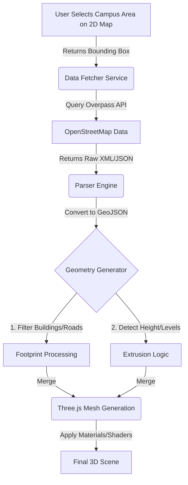

Here is the comprehensive technical blueprint for building the **"Auto-Twin Engine."**

This architecture does not require manual 3D modeling. It uses a **Procedural Generation Pipeline** that converts live OpenStreetMap (OSM) data into a specialized Three.js scene, specifically styled to look like a management game (e.g., *Cities: Skylines*).

***

```markdown
# The Auto-Twin Engine: Technical Blueprint

## 1. Executive Summary
This engine is a **Browser-Based Procedural Generator**. 
1.  **Input:** User selects a rectangular Bounding Box (BBOX) on a 2D map.
2.  **Process:** The engine fetches vector data (GeoJSON) from the Overpass API (OpenStreetMap).
3.  **Core Logic:** It triangulates 2D footprints and extrudes them based on metadata (height/levels) into 3D meshes.
4.  **Output:** An interactive, stylized 3D world in the browser where buildings are individually addressable objects (ready for IoT data binding).

---

## 2. Technology Stack (The Requirements)
To ensure this works without error, use this exact combination of libraries.

*   **Framework:** **React** (for state management of the UI).
*   **3D Engine:** **React Three Fiber (R3F)** (A React wrapper for Three.js).
*   **Data Source:** **Overpass API** (Free interface to access OpenStreetMap data).
*   **Geospatial Math:** **Turf.js** (For calculating distances/areas) & **geolib** (for Lat/Lon conversion).
*   **Geometry Utility:** **Earcut** (Crucial: converts 2D polygon points into 3D faces).
*   **Map Selection:** **Mapbox GL JS** or **Leaflet** (for the initial 2D selector).

---

## 3. System Architecture


---

## 4. The Development Steps

### Phase 1: The "Selector" Module (2D)
The user cannot blindly generate a model; they need to define the "World Boundaries."

**Implementation:**
1.  Render a standard Mapbox/Leaflet 2D map.
2.  Add a "Draw Rectangle" tool.
3.  When the user releases the mouse, capture the **South-West** and **North-East** coordinates.
4.  **Output:** A constant called `BBOX`: `[minLat, minLon, maxLat, maxLon]`.

### Phase 2: The Data Fetcher (The Crawler)
We do not store the map; we fetch it live. We use the **Overpass QL** language to ask OSM for data.

**The Logic:**
Construct a query that asks for "Ways" (shapes) that have a "building" tag within our BBOX.

```javascript
// Function to fetch data from OSM
async function fetchCampusData(bbox) {
  // Convert bbox array to string: (south, west, north, east)
  const boxString = `${bbox[0]},${bbox[1]},${bbox[2]},${bbox[3]}`;
  
  // The Overpass Query asking for Buildings, Roads, and Leisure (parks)
  const query = `
    [out:json];
    (
      way["building"](${boxString});
      relation["building"](${boxString});
      way["highway"](${boxString});
      way["leisure"="park"](${boxString});
      way["natural"="water"](${boxString});
    );
    (._;>;);
    out body;
  `;

  const response = await fetch("https://overpass-api.de/api/interpreter", {
    method: "POST",
    body: query
  });
  
  return await response.json();
}
```

### Phase 3: The Geometry Engine (The Hard Part)
This is where the raw data becomes 3D. 

#### A. Coordinate Normalization
GPS coordinates are huge numbers. If you put them into Three.js, you get floating-point errors (glitches).
*   **The Fix:** Pick the **Center** of the campus as `(0,0,0)`.
*   Convert all other Lat/Lon points to meters relative to that center (Mercator Projection).

#### B. The Extrusion Loop
You will iterate through every building returned by the API.

```javascript
import * as THREE from 'three';
import earcut from 'earcut'; // Required for triangulation

function generateBuildingMesh(feature, centerPoint) {
  // 1. Get Building Height (Fallbacks are critical)
  let height = 10; // Default 10 meters (approx 3 floors)
  if (feature.properties.height) height = parseFloat(feature.properties.height);
  else if (feature.properties.levels) height = feature.properties.levels * 3.5;

  // 2. Process Footprint Shape
  const shape = new THREE.Shape();
  // ... Convert Lat/Lon points to Vector2(x,y) relative to center ... 
  // ... Use moveTo() and lineTo() to draw the shape ...

  // 3. Extrude (Create 3D Volume)
  const extrudeSettings = {
    steps: 1,
    depth: height, // "Depth" is height in Three.js Z-up
    bevelEnabled: false, // Keep it sharp/low-poly
  };

  const geometry = new THREE.ExtrudeGeometry(shape, extrudeSettings);
  
  // 4. Optimization: Rotate to sit flat on ground
  geometry.rotateX(-Math.PI / 2);
  
  return geometry;
}
```

### Phase 4: Styling (The "Gamified" Look)
Do not use textures (images of bricks). To look like the reference image, you must use **Materials** and **Lighting**.

1.  **Categorization:** Inside the logic, read the building type.
    *   `if (tags.building === 'dormitory') useColor('#FF8C00') // Orange`
    *   `if (tags.building === 'school') useColor('#4682B4') // Blue`
    *   `else useColor('#FFFFFF') // White`
2.  **The Material:** Use `MeshStandardMaterial` with slightly high roughness to look like clean plastic/clay.
3.  **Edges:** To get that sharp "Architectural Model" look, add an `EdgesGeometry` line loop around every building mesh.

### Phase 5: Interaction & Integration (Connecting your Data)
The engine assigns the **OSM ID** (a unique number from the map data) to the 3D Mesh User Data.

**The "Smart" Connection:**
1.  **State:** Store your IoT data in a React State object.
    ```javascript
    const campusState = {
      "14239012": { power: "high", waste: 90 }, // 14239012 is the OSM Building ID
      "99882211": { power: "low", waste: 10 }
    }
    ```
2.  **The Render Loop:** 
    When generating the mesh, check the ID against your sensor state.
    *   If `power === 'high'`, set the mesh `.emissive` property to Red (glow effect).

---

## 5. Potential Pitfalls & Fixes

| Issue | Cause | The Fix in Engine |
| :--- | :--- | :--- |
| **"Holes" in Map** | OpenStreetMap data is incomplete. | Add a "Filler" logic: If an area is empty but enclosed by roads, render it as generic green grass. |
| **Z-Fighting** | Roads and ground mesh overlapping. | Lift buildings by `0.1m` and roads by `0.05m` above the ground plane. |
| **Performance** | Too many separate building meshes (Draw Calls). | Use **InstancedMesh** for trees. Merge static geometry (like all roads) into one single buffer geometry using `BufferGeometryUtils.mergeBufferGeometries`. |

---

## 6. Implementation Checklist

To build this:

1.  [ ] **Project Init:** `npx create-react-app digital-twin`
2.  [ ] **Install Deps:** `npm install three @react-three/fiber @react-three/drei osmtogeojson earcut`
3.  [ ] **Build API Service:** Create the fetcher function using Overpass QL (Phase 2 code).
4.  [ ] **Build Parser:** Write the transformer to convert GeoJSON coords to Vector3.
5.  [ ] **Build Scene:** Set up `<Canvas>` with `<DirectionalLight>` and shadows enabled.
6.  [ ] **Link Logic:** Add mouse `onClick` events to meshes to open your data modals.

**End Result:** A scalable, zero-design engine that builds a new 3D campus simply by entering GPS coordinates.
```